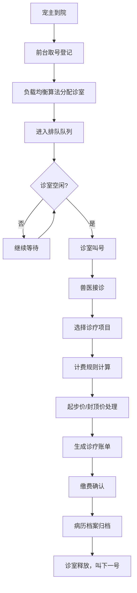

## 1. 产品概述

宠物诊疗排号系统是一款面向宠物医院的智能排队叫号与诊疗计费管理Web应用。系统支持多诊室并行叫号、智能负载均衡、阶梯式计费规则和自动账单生成，旨在提升宠物医院的接诊效率与服务质量。

- 解决宠物医院高峰期排队混乱、诊室利用率不均、计费不透明等问题
- 目标用户：宠物医院前台、兽医、管理员

## 2. 核心功能

### 2.1 用户角色

| 角色 | 登录方式 | 核心权限 |
|------|----------|----------|
| 前台人员 | 账号密码登录 | 取号登记、叫号操作、查看队列 |
| 兽医 | 账号密码登录 | 接诊叫号、填写病历、完成诊疗 |
| 管理员 | 账号密码登录 | 诊室管理、费率配置、数据统计 |

### 2.2 功能模块

1. **并行叫号模块**：取号排队、多诊室并行叫号、叫号状态管理
2. **负载均衡模块**：智能分配诊室、跨诊室调剂、负载状态监控
3. **计费规则模块**：起步价计算、封顶价拦截、项目分类计费
4. **账单生成模块**：诊疗账单、病历档案、收费记录

### 2.3 页面详情

| 页面名称 | 模块名称 | 功能描述 |
|----------|----------|----------|
| 首页仪表盘 | 总览模块 | 今日就诊数、在候诊数、各诊室状态、实时叫号大屏 |
| 取号排队页 | 并行叫号模块 | 宠主信息录入、取号、排队队列展示 |
| 诊室叫号页 | 并行叫号模块 | 多诊室并行叫号、接诊/完成操作、当前患宠信息 |
| 负载监控页 | 负载均衡模块 | 各诊室负载率、等待时间预估、跨诊室调剂操作 |
| 诊疗计费页 | 计费规则模块 | 诊疗项目选择、起步价/封顶价计算、费用明细 |
| 病历档案页 | 计费规则模块 | 患宠档案、历史诊疗记录、病历详情 |
| 账单管理页 | 账单生成模块 | 账单列表、账单详情、打印/导出 |
| 系统设置页 | 系统配置 | 诊室管理、费率配置、项目管理 |

## 3. 核心流程

### 3.1 就诊流程

宠主到院 → 前台取号（录入患宠信息） → 负载均衡分配诊室 → 排队等待 → 诊室叫号 → 兽医接诊诊疗 → 选择诊疗项目 → 计费计算（起步价/封顶价） → 生成账单 → 缴费完成 → 病历归档

### 3.2 流程图

## 4. 用户界面设计

### 4.1 设计风格

- **主色调**：医疗青绿色（#10B981），传达专业、安心的医疗氛围
- **辅助色**：温暖橙色（#F59E0B）用于叫号提醒，蓝色（#3B82F6）用于信息展示
- **中性色**：深灰（#1F2937）、中灰（#6B7280）、浅灰（#F3F4F6）
- **按钮风格**：圆角大按钮，悬停有轻微上浮和阴影效果
- **字体**：现代无衬线字体，标题加粗，正文清晰易读
- **布局风格**：卡片式布局，分区明确，信息层级清晰
- **图标风格**：线性图标，简洁现代

### 4.2 页面设计概览

| 页面名称 | 模块名称 | UI元素 |
|----------|----------|--------|
| 首页仪表盘 | 总览模块 | 数据卡片网格、诊室状态卡片、叫号大屏区域 |
| 取号排队页 | 并行叫号模块 | 取号表单、排队列表卡片、叫号状态提示 |
| 诊室叫号页 | 并行叫号模块 | 诊室选择标签页、当前患宠卡片、叫号操作按钮组 |
| 负载监控页 | 负载均衡模块 | 负载率进度条、诊室对比图表、调剂操作面板 |
| 诊疗计费页 | 计费规则模块 | 项目选择列表、费用明细面板、起步/封顶价标识 |
| 病历档案页 | 计费规则模块 | 患宠信息卡、时间轴病历记录、详情展开面板 |
| 账单管理页 | 账单生成模块 | 账单列表表格、账单详情弹窗、操作按钮列 |
| 系统设置页 | 系统配置 | 左侧导航菜单、右侧配置表单、费率设置卡片 |

### 4.3 响应式

- 桌面端优先设计，支持1280px及以上分辨率
- 平板端自适应布局，卡片重新排列
- 移动端简化展示，核心功能优先

### 4.4 动效设计

- 叫号时有脉冲动画提醒
- 卡片悬停有轻微上浮效果
- 页面切换有淡入过渡
- 数据更新有平滑数字变化
