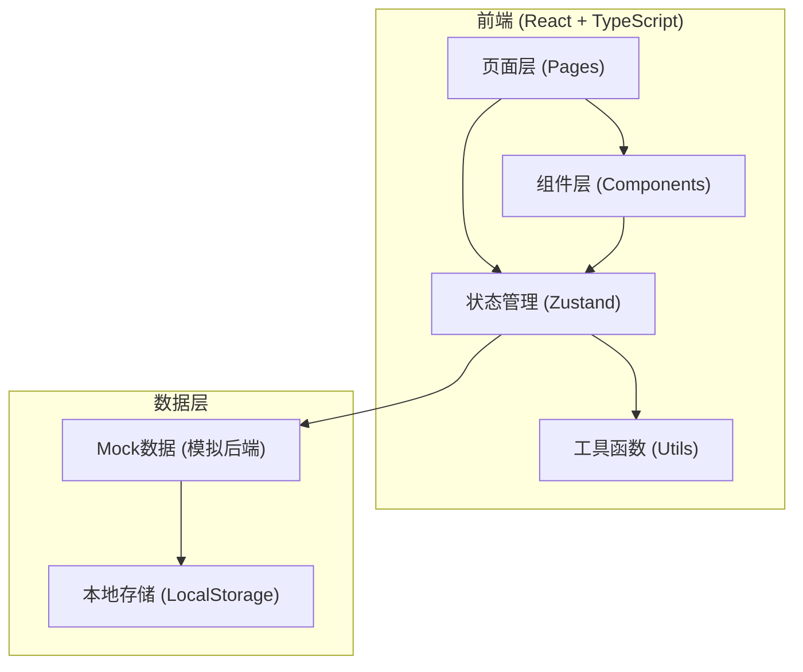
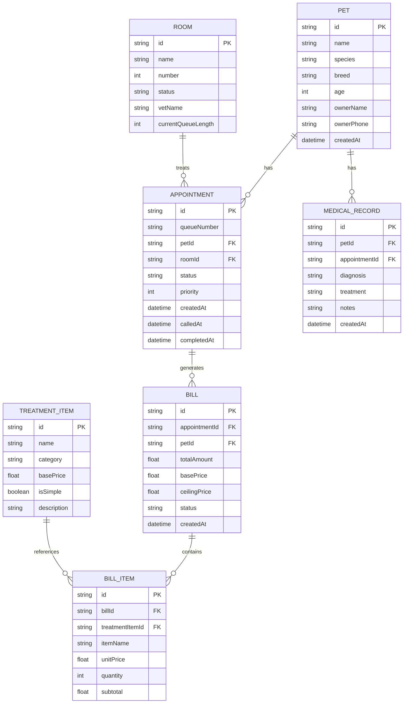

## 1. 架构设计



## 2. 技术描述

- **前端框架**：React@18 + TypeScript
- **构建工具**：Vite
- **样式方案**：TailwindCSS@3
- **状态管理**：Zustand
- **路由管理**：React Router DOM
- **图标库**：Lucide React
- **后端**：纯前端Mock数据（LocalStorage持久化）
- **数据存储**：LocalStorage + 内存状态

## 3. 路由定义

| 路由路径 | 页面名称 | 用途 |
|----------|----------|------|
| / | 首页仪表盘 | 总览数据统计、叫号大屏 |
| /queue | 取号排队 | 患宠取号、排队队列展示 |
| /rooms | 诊室叫号 | 多诊室并行叫号管理 |
| /load-balance | 负载监控 | 负载均衡状态、跨诊室调剂 |
| /billing | 诊疗计费 | 诊疗项目选择、费用计算 |
| /medical-records | 病历档案 | 患宠档案、历史病历 |
| /bills | 账单管理 | 账单列表、账单详情 |
| /settings | 系统设置 | 诊室、费率、项目配置 |

## 4. 数据模型

### 4.1 ER图



### 4.2 核心数据类型

```typescript
// 患宠
interface Pet {
  id: string;
  name: string;
  species: 'dog' | 'cat' | 'other';
  breed: string;
  age: number;
  ownerName: string;
  ownerPhone: string;
  createdAt: string;
}

// 诊室
interface Room {
  id: string;
  name: string;
  number: number;
  status: 'idle' | 'busy' | 'offline';
  vetName: string;
  currentPatientId?: string;
}

// 排队号
interface Appointment {
  id: string;
  queueNumber: string;
  petId: string;
  roomId: string;
  status: 'waiting' | 'called' | 'visiting' | 'completed' | 'cancelled';
  priority: number;
  createdAt: string;
  calledAt?: string;
  completedAt?: string;
}

// 诊疗项目
interface TreatmentItem {
  id: string;
  name: string;
  category: string;
  basePrice: number;
  isSimple: boolean;
  description: string;
}

// 账单
interface Bill {
  id: string;
  appointmentId: string;
  petId: string;
  items: BillItem[];
  subtotal: number;
  totalAmount: number;
  status: 'unpaid' | 'paid' | 'refunded';
  createdAt: string;
}

// 账单明细
interface BillItem {
  id: string;
  treatmentItemId: string;
  itemName: string;
  unitPrice: number;
  quantity: number;
  subtotal: number;
}

// 病历
interface MedicalRecord {
  id: string;
  petId: string;
  appointmentId: string;
  diagnosis: string;
  treatment: string;
  notes: string;
  createdAt: string;
}

// 计费规则配置
interface BillingConfig {
  basePrice: number;
  ceilingPrice: number;
  simpleItemMultiplier: number;
  complexItemMultiplier: number;
}
```

## 5. 核心模块设计

### 5.1 并行叫号模块

- **取号功能**：录入患宠信息生成排队号，按时间顺序排队
- **多诊室叫号**：每个诊室独立叫号，互不干扰
- **状态流转**：等待 → 已叫号 → 就诊中 → 已完成
- **叫号大屏**：实时显示各诊室当前叫号信息

### 5.2 负载均衡模块

- **智能分配**：新取号时自动分配到等待人数最少的诊室
- **负载计算**：根据等待人数和平均诊疗时间计算负载率
- **跨诊室调剂**：支持手动将患宠从一个诊室调剂到另一个诊室
- **预估等待**：根据当前负载预估每个患宠的等待时间

### 5.3 计费规则模块

- **起步价机制**：简单项目按起步价收取，不足起步价按起步价计算
- **封顶价机制**：复杂项目总额超过封顶价时按封顶价收取
- **项目分类**：简单项目/复杂项目两类，分别适用不同计费规则
- **费用明细**：清晰展示每项费用及起步/封顶价调整说明

### 5.4 账单生成模块

- **自动生成**：诊疗完成后自动生成账单
- **账单详情**：展示诊疗项目、数量、单价、小计、总计
- **支付状态**：未支付/已支付/已退款状态管理
- **病历关联**：账单与病历、患宠档案关联

## 6. 项目结构

```
src/
├── components/          # 通用组件
│   ├── Layout.tsx       # 页面布局
│   ├── Sidebar.tsx      # 侧边导航
│   ├── StatusBadge.tsx  # 状态标签
│   ├── PetCard.tsx      # 患宠卡片
│   └── RoomCard.tsx     # 诊室卡片
├── pages/               # 页面组件
│   ├── Dashboard.tsx    # 首页仪表盘
│   ├── Queue.tsx        # 取号排队
│   ├── Rooms.tsx        # 诊室叫号
│   ├── LoadBalance.tsx  # 负载监控
│   ├── Billing.tsx      # 诊疗计费
│   ├── MedicalRecords.tsx # 病历档案
│   ├── Bills.tsx        # 账单管理
│   └── Settings.tsx     # 系统设置
├── store/               # 状态管理
│   ├── usePetStore.ts
│   ├── useQueueStore.ts
│   ├── useRoomStore.ts
│   ├── useBillingStore.ts
│   └── useSettingsStore.ts
├── utils/               # 工具函数
│   ├── loadBalancer.ts  # 负载均衡算法
│   ├── billing.ts       # 计费规则
│   └── mock.ts          # Mock数据
├── types/               # 类型定义
│   └── index.ts
├── App.tsx
├── main.tsx
└── index.css
```
